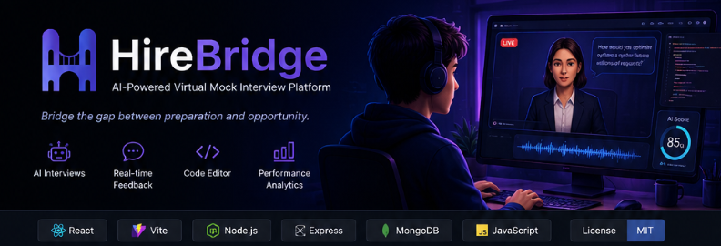

<p align="center">
  
</p>

<div align="center">

# 🚀 HireBridge

### AI-Powered Virtual Mock Interview Platform

**Bridge the Gap Between Preparation and Opportunity**


</div>

---

# 📖 About HireBridge

**HireBridge** is an AI-powered virtual mock interview platform that helps students and job seekers prepare for real-world technical and HR interviews through intelligent interview simulations.

The platform recreates an authentic interview environment by combining AI-powered interviewers, coding assessments, personalized feedback, and performance analytics into a single interactive application.

Whether preparing for campus placements, internships, or professional roles, HireBridge provides a structured and immersive interview experience that improves confidence, technical skills, and communication abilities.

---

# ✨ Features

### 🤖 AI Mock Interviews

- Interactive AI interviewer
- Technical interview simulation
- HR interview simulation
- Real-time conversation flow

### 💻 Coding Assessment

- Built-in code editor
- Coding challenge environment
- Syntax highlighting
- Real-time programming experience

### 📊 Performance Analytics

- Interview score analysis
- Skill-wise evaluation
- Performance tracking
- Progress visualization

### 💬 Personalized Feedback

- AI-generated feedback
- Communication assessment
- Technical evaluation
- Improvement suggestions

### 🎯 Role-Based Preparation

Prepare interviews for roles such as:

- Full Stack Developer
- Frontend Developer
- Backend Developer
- Software Engineer
- Cloud Engineer
- Data Analyst

---

# 🖼️ Project Screenshots

<table>
<tr>

<td align="center">

### 🏠 Home Page


</td>

<td align="center">

### 🎤 AI Interview


</td>

</tr>

<tr>

<td align="center">

### 💻 Coding Round


</td>

<td align="center">

### 📊 Performance Dashboard


</td>

</tr>

</table>

---

# 🏗️ System Architecture

```
                  User
                    │
                    ▼
             React Frontend
                    │
                    ▼
            Express.js Backend
                    │
      ┌─────────────┴─────────────┐
      ▼                           ▼
 Interview Engine         Question Management
      │                           │
      └─────────────┬─────────────┘
                    ▼
             MongoDB Database
```

---

# 🛠️ Tech Stack

## Frontend

- React
- Vite
- JavaScript
- HTML5
- CSS3

## Backend

- Node.js
- Express.js

## Database

- MongoDB

## Development Tools

- Git
- GitHub
- VS Code
- Postman

---

# 📂 Project Structure

```
HireBridge/

│── frontend/
│   ├── public/
│   ├── src/
│   │   ├── assets/
│   │   ├── components/
│   │   ├── pages/
│   │   ├── App.jsx
│   │   └── main.jsx
│   └── package.json

│── backend/
│   ├── controllers/
│   ├── routes/
│   ├── models/
│   ├── questions.js
│   ├── server.js
│   └── package.json

│── header.jpg
│── README.md
```

---

# ⚙️ Installation

## Clone Repository

```bash
git clone https://github.com/Mathumitha-create/HireBridge.git
```

---

## Frontend Setup

```bash
cd frontend

npm install

npm run dev
```

---

## Backend Setup

```bash
cd backend

npm install

npm start
```

---

# 🎯 Core Modules

### 🏠 Landing Page

Modern responsive landing page introducing the HireBridge platform.

---

### 🔐 Authentication

Secure user login and authentication system.

---

### 🎤 Interview Module

AI-powered interview simulation supporting technical and HR interview rounds.

---

### 💻 Coding Module

Interactive coding assessment with an integrated code editor.

---

### 📊 Analytics Module

Tracks interview performance, scores, and improvement over time.

---

### 💬 Feedback Module

Provides AI-powered personalized interview feedback and suggestions.

---

# 🌟 Why HireBridge?

✅ Realistic Interview Experience

✅ AI-Powered Interview Simulation

✅ Coding Round Practice

✅ Personalized Performance Feedback

✅ Role-Based Interview Preparation

✅ Interactive User Interface

✅ Performance Analytics

✅ Placement Readiness

---

# 🚀 Future Enhancements

- 🎙️ Voice-Based AI Interview
- 🤖 LLM-Powered Dynamic Question Generation
- 📄 AI Resume Analysis
- 📹 Video Interview Recording
- 🌍 Multi-language Support
- ☁️ Cloud Deployment
- 📱 Mobile Application
- 📅 Interview Scheduling
- 📊 Advanced Analytics Dashboard
- 🏢 Company-Specific Interview Preparation

---

# 👥 Team

| Team Member | Responsibility |
|--------------|----------------|
| **Mathumitha S** | Frontend Development & UI Design |
| **Jashwanth J** | Backend Development |
| **Madhusree M** | AI Integration & Testing |
| **Harshini A** | Database Management & Documentation |

---

# 📜 License

This project is developed for educational and learning purposes.

---

<div align="center">

# ⭐ HireBridge ⭐

### Bridge the Gap Between Preparation and Opportunity

**Empowering Careers through AI-Powered Interview Preparation**

Made with ❤️ by **Team HireBridge**

</div>
